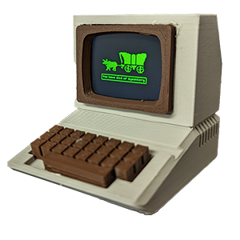
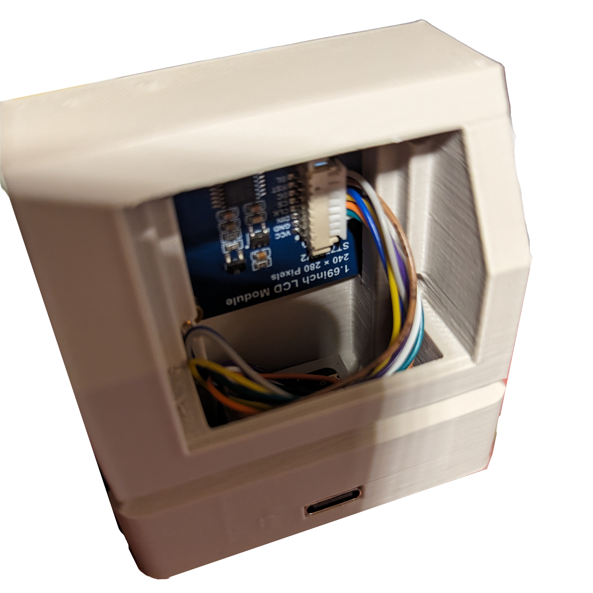

# Miniature Apple II with working screen
</img>
The Miniature Apple IIe project was inspired by this [Tiny Raspberry Pi Zero Mac](https://www.instructables.com/Making-a-Tiny-Mac-From-a-Raspberry-Pi-Zero) and many other attempts at making Pi-based Apple computers, including many Apple II's.  I found the screen on the working Mac model to be too small to really be usable and, while certainly impressive, generally unnecessary to trigger all of the nostalgia endorphins.  This project attempts to create a simple-to-build and cost-effect (less than $20) Apple II that can be used to display some sweet, sweet nostalgia (hello, Oregon Trail) or as a platform for more advanced projects.  In addition to being cheap ($5), the XIAO ESP32C23 microcontroller has BLE and Wifi so it could serve up some pretty impressive content.

### A note on history...
The model is technically based on an original Apple II with an Apple Monitor II, a green monochrome CRT.  The software presents an amalgam of several of the Apple II computers, notably the Apple IIs and Apple IIe with IIgs-style graphics.  Think of it as a mid-80's-era Apple IIe computer, capturing the nostalgic bits of several pieces of the early Apple II line, as opposed to a strict recreation of a specific model.

## Assemble The Model

### Materials
- 3D-printed Apple II case and components.
  - Beige PLA [Beige PLA](https://www.amazon.com/gp/product/B09TR8N5T2/ref=ppx_yo_dt_b_search_asin_title?ie=UTF8&psc=1)
  - [Brown PLA](https://www.amazon.com/gp/product/B0991VV5SX/ref=ppx_yo_dt_b_search_asin_title?ie=UTF8&psc=1)
  - Originally based on [Mini Apple II](https://www.thingiverse.com/thing:3643947) but heavily modified to support the electronics.
- XIAO ST7789V2 LCD Display [Seeed Studio](https://www.seeedstudio.com/1-69inch-240-280-Resolution-IPS-LCD-Display-Module-p-5755.html) | [GitHub](https://github.com/limengdu/XIAO_ST7789V2_LCD_Display/) | [Buy on Digikey](https://www.digikey.com/en/products/detail/seeed-technology-co-ltd/104990802/21526011)
- XIAO ESP32C23 Microcontroller [Seeed Studio](https://www.seeedstudio.com/Seeed-XIAO-ESP32C3-p-5431.html) | [Buy on digikey](https://www.digikey.com/en/products/detail/seeed-technology-co-ltd/113991054/16652880)
- M2x6mm screws (optional) [Here's a nice set](https://www.amazon.com/gp/product/B014OO5KQG/ref=ppx_yo_dt_b_search_asin_title?ie=UTF8&psc=1)

### Printing
Be sure to support the model internally when printing.  It took my Ender 3 about 2.5 hrs to print the case, which is perfect for assembling the electronics and programming it while it's printing.

### Connecting LCD to the Microcontroller
| LCD | Microcontroller | Color* |
|-----|-----|--------|
| VCC | 3V3 | Purple |
| GND | GND | White  |
| DIN | D10 | Green  |
| CLK | D8  | Orange |
| CS  | D1  | Yellow |
| DC  | D3  | Blue   |
| RST | D0  | Brown  |
| BL  | D6  | Gray   |

*=Be sure to verify color codes against the actual cable.

```
Viewing from the rear of the PCB (face down).  Double-check color codes.
      +-----------+
 GRY -|D6       D7|-
     -|D5       D8|- ORN
     -|D4       D9|-
 BLU -|D3      D10|- GRN
     -|D2      3V3|- PUR
 YEL -|D1      GND|- WHT
 BRN -|D0      USB|-
      +---|USB|---+
          +---+
```

If you're just getting started with electronics, it's a good idea to solder the headers onto the PCB and connect the LCD via the included breakout cable.  More experienced makers can cut the cable down to about 1.5" and solder directly onto the microcontroller.  Note that the controller will be "upside down" in the case; this orientation supports using the included headers and also wires soldered directly to the back.  A notch in the XIAO "tray" inside the unit allows for the antenna to be attached.  I strongly recommend connecting the electronics and programming (next step) before assembling into the printed case, tempting as it might be.

### Programming
1. Follow the instructions on [Seeed's Wiki](https://wiki.seeedstudio.com/XIAO_ESP32C3_Getting_Started/) to set up the Arduino development environment.
2. Clone this repo and open one of the files from the Controller path in Arduino Studio.
3. Select the appropriate board (probably XIAO ESP32C3) and port (probably a COMn port).
4. Upload the INO to the controller and verify that it works.

### Assembly
</img>
1. **Feed the programmed & tested microcontroller through the front of the unit.**  Do not actually attach the LCD to the plastic yet (just leave it dangling)
2. **Snap the microcontroller "upside-down" into the holder by the USB port opening.**  This can be a bit tricky; you will need to make sure the USB-C port protrudes into the wall of the computer and will need to press firmly on the rear of the PCB to snap it below the nubs holding it in place.  If the microcontroller breaks loose during normal operation due to strain on the USB port, you can add a dab of hot glue at the rear of the PCB to keep it from popping up.
4. **Install the LCD.**  The posts on the LCD should line up and slide inside of the holes on the monitor face.  Optionally screw in the LCD using the M2x6mm screws; be careful to not overtighten.
5. **Position the optional wifi antenna** such that it is not bent and that the solder on the antenna will never come in contact with other electronics.  I recommend positioning it vertically with its solder-free side against the LCD.  Optionally attach the antenna with the included adhesive backing.
6. **Snap the plastic pieces into place;** bezel, keyboard, and CRT back, being careful not to pinch any wires or the antenna with the CRT back.  The ability to snap the pieces in place is a significant departure from the original 3D model.  Depending on your printer and settings, you may need to adjust tolerances.

## Customizing the Software
### Custom Graphics
Loading raster graphics onto the unit is not terribly elegant but should be straightforward with the included python script.
1. Create a 260x240 pixel image
2. Convert the image to 16-bit 5-6-5 depth and export as hex using the included Python script  For example:
```
ImageConvert.py OregonTrail/oregon1.png
```
3. Open the result (out.txt) and paste into graphics.cpp, cleaning up syntax (commas, brackets, etc)

### Future Additions
Some things I'd like to do (also known as "exercises left for the reader")
- Add image compression/decompression--A single uncompressed image takes about 600k but even basic RLE compression could reduce that significantly.  I have a RLE-ish compression scheme in mind.
- Use Bluetooth or wifi for...something--make it a clock / weather station / subway tracker / whatever.
- Implement USB host functionality and interface with HID devices and/or Bluetooth HID devices.
- Make an actual BASIC or LOGO interpreter.  The Apple II had 4K...the XIAO has 4M!
- Make an actual Apple II emulator...this [appears to be possible](https://github.com/dpeckett/arduino-appleii) so somebody should go for it!

## Additional References
- [Arduino Library .h File](https://github.com/limengdu/XIAO_ST7789V2_LCD_Display/blob/main/st7789v2.h)
- [Apple IIe LOGO emulator](https://www.scullinsteel.com/apple//e#logo)
- [Apple II emulator on Arduino](https://github.com/dpeckett/arduino-appleii) - Future aspirations!

## Send Some Love (in the form of coffee)
<a href="https://www.buymeacoffee.com/jmshearer" target="_blank"></a>
